# Casos de Uso — BearPizzeria

## Actor: Cliente Hambriento

| Código | Nombre | Descripción | Estado |
|--------|--------|-------------|--------|
| UC-01 | Registrar Cliente | El cliente ingresa sus datos personales para identificarse en el sistema. | ✅ Implementado (`POST /api/clientes`) |
| UC-02 | Consultar Catálogo | El cliente visualiza la lista de pizzas disponibles con sus precios. | ✅ Implementado (`GET /api/pizzas`) |
| UC-03 | Realizar Pedido | El cliente selecciona pizzas, indica cantidades y confirma su pedido. | ✅ Implementado (`POST /api/pedidos`) |
| UC-04 | Consultar Estado de Pedido | El cliente consulta en qué estado se encuentra su pedido. | ✅ Implementado (`GET /api/pedidos/{id}`) |

## Actor: Backend (API)

| Código | Nombre | Descripción | Estado |
|--------|--------|-------------|--------|
| UC-05 | Gestionar Pedidos | El backend recibe, valida y persiste los pedidos entrantes. | ✅ Implementado |
| UC-06 | Notificar a Cocina | El backend envía por socket TCP los pedidos pendientes de preparación. | ✅ Implementado |
| UC-07 | Notificar a Reparto | El backend envía por socket TCP los pedidos listos para entregar. | ❌ No implementado (método `EnviarADeliveryAsync` existe pero nunca se invoca) |
| UC-08 | Actualizar Estado | El backend actualiza el estado del pedido. | ⚠️ Parcial: solo vía `PATCH /api/pedidos/{id}/estado` (manual). Los mensajes `ActualizarEstado` por socket TCP son ignorados por el backend. |

## Actor: Cocina Automatizada

| Código | Nombre | Descripción | Estado |
|--------|--------|-------------|--------|
| UC-09 | Recibir Pedido | La cocina escucha por socket TCP los nuevos pedidos pendientes. | ✅ Implementado (recibe y muestra el pedido) |
| UC-10 | Iniciar Preparación | La cocina simula la preparación del pedido. | ⚠️ Parcial: solo simulación local (delay 5s). El mensaje `ActualizarEstado` que envía es ignorado por el backend. |
| UC-11 | Notificar Pedido Listo | La cocina informa que el pedido está listo para reparto. | ❌ El backend ignora el mensaje `ActualizarEstado` con `Estado: EnViaje`. Usar `PATCH /api/pedidos/{id}/estado` manualmente. |

## Actor: Reparto

| Código | Nombre | Descripción | Estado |
|--------|--------|-------------|--------|
| UC-12 | Recibir Notificación | El reparto escucha por socket TCP los pedidos en viaje. | ❌ No implementado: `EnviarADeliveryAsync` nunca se invoca, por lo que Reparto nunca recibe notificaciones. |
| UC-13 | Confirmar Entrega | El reparto notifica al backend que el pedido fue entregado. | ❌ El backend ignora el mensaje `ActualizarEstado` con `Estado: Entregado`. Usar `PATCH /api/pedidos/{id}/estado` manualmente. |

---

## Diagrama General de Casos de Uso

```mermaid
flowchart TB
    subgraph "Sistema BearPizzeria"
        direction TB
        UC01["UC-01: Registrar Cliente ✅"]
        UC02["UC-02: Consultar Catálogo ✅"]
        UC03["UC-03: Realizar Pedido ✅"]
        UC04["UC-04: Consultar Estado ✅"]
        UC05["UC-05: Gestionar Pedidos ✅"]
        UC06["UC-06: Notificar a Cocina ✅"]
        UC07["UC-07: Notificar a Reparto ❌"]
        UC08["UC-08: Actualizar Estado ⚠️"]
        UC09["UC-09: Recibir Pedido ✅"]
        UC10["UC-10: Iniciar Preparación ⚠️"]
        UC11["UC-11: Notificar Listo ❌"]
        UC12["UC-12: Recibir Notificación ❌"]
        UC13["UC-13: Confirmar Entrega ❌"]
    end

    CH["Cliente Hambriento"]
    BE["Backend"]
    CO["Cocina Automatizada"]
    RE["Reparto"]

    CH --> UC01
    CH --> UC02
    CH --> UC03
    CH --> UC04
    BE --> UC05
    BE --> UC06
    BE -.-> UC07
    BE --> UC08
    CO --> UC09
    CO --> UC10
    CO -.-> UC11
    RE -.-> UC12
    RE -.-> UC13

    style UC07 stroke:#f00,stroke-dasharray: 5 5
    style UC08 stroke:#fa0,stroke-dasharray: 5 5
    style UC10 stroke:#fa0,stroke-dasharray: 5 5
    style UC11 stroke:#f00,stroke-dasharray: 5 5
    style UC12 stroke:#f00,stroke-dasharray: 5 5
    style UC13 stroke:#f00,stroke-dasharray: 5 5
```



**Leyenda:**
- ✅ = Implementado y funcional
- ⚠️ = Parcialmente implementado (limitaciones conocidas)
- ❌ = No implementado / ignorado por el backend
- Línea punteada = Conexión disfuncional o incompleta

---

## Flujo Real del Sistema (lo que realmente funciona)

```
Cliente → POST /api/clientes              → Registro exitoso
Cliente → GET  /api/pizzas                 → Catálogo visible
Cliente → POST /api/pedidos                → Pedido creado + notificación a Cocina
Cliente → GET  /api/pedidos/{id}           → Estado visible
Usuario → PATCH /api/pedidos/{id}/estado   → Avanza estado manualmente

Cocina  → [TCP] Recibe "NuevoPedido"       → Muestra en pantalla
Cocina  → [TCP] Envía "ActualizarEstado"   → ❌ IGNORADO por el backend

Reparto → [TCP] Nunca recibe notificación  → ❌ No implementado
Reparto → [TCP] Envía "ActualizarEstado"   → ❌ IGNORADO por el backend
```

---

## Especificación de Casos de Uso

### UC-01: Registrar Cliente ✅

| Campo | Valor |
|-------|-------|
| **Actor** | Cliente Hambriento |
| **Endpoint** | `POST /api/clientes` |
| **Descripción** | El cliente ingresa usuario, nombre, dirección, teléfono y email para registrarse. |
| **Precondición** | El cliente no existe en el sistema. |
| **Flujo básico** | 1. El cliente envía sus datos vía `POST /api/clientes`.<br>2. El backend valida los datos (FluentValidation).<br>3. El backend verifica unicidad de Usuario y Email.<br>4. El backend persiste el cliente.<br>5. El backend retorna `201 Created` con el cliente creado. |
| **Flujo alternativo** | 2a. Datos inválidos → `400 Bad Request` con detalle.<br>3a. Usuario o Email duplicado → `400 Bad Request`. |
| **Postcondición** | El cliente queda registrado y puede realizar pedidos. |

### UC-02: Consultar Catálogo ✅

| Campo | Valor |
|-------|-------|
| **Actor** | Cliente Hambriento |
| **Endpoint** | `GET /api/pizzas` |
| **Descripción** | El cliente obtiene la lista de pizzas disponibles. |
| **Precondición** | Existen pizzas cargadas en el catálogo. |
| **Flujo básico** | 1. El cliente solicita `GET /api/pizzas`.<br>2. El backend consulta la base de datos.<br>3. El backend retorna la lista de pizzas con `200 OK`. |

### UC-03: Realizar Pedido ✅

| Campo | Valor |
|-------|-------|
| **Actor** | Cliente Hambriento |
| **Endpoint** | `POST /api/pedidos` |
| **Descripción** | El cliente selecciona pizzas, cantidades y confirma su pedido. |
| **Precondición** | El cliente está registrado. Las pizzas existen en el catálogo. |
| **Flujo básico** | 1. El cliente envía `POST /api/pedidos` con `ClienteUsuario` y lista de `{PizzaNombre, Cantidad}`.<br>2. El backend valida los datos.<br>3. El backend busca al cliente por `Usuario`.<br>4. El backend normaliza nombres de pizzas y las busca en la BD.<br>5. El backend calcula el total.<br>6. El backend persiste el pedido con estado `EnPreparacion`.<br>7. El backend notifica a Cocina por socket TCP (`NuevoPedido`).<br>8. El backend retorna `201 Created` con el detalle del pedido. |
| **Flujo alternativo** | 2a. Datos inválidos → `400 Bad Request`.<br>3a. Cliente inexistente → `400 Bad Request`.<br>4a. Pizza inválida → `400 Bad Request`.<br>7a. Cocina no conectada → el pedido se persiste igual, la notificación se pierde (sin cola persistente). |
| **Postcondición** | El pedido queda registrado en estado `EnPreparacion`. |

### UC-04: Consultar Estado de Pedido ✅

| Campo | Valor |
|-------|-------|
| **Actor** | Cliente Hambriento |
| **Endpoint** | `GET /api/pedidos/{id}` |
| **Descripción** | El cliente verifica el estado actual de su pedido. |
| **Precondición** | El pedido existe en el sistema. |
| **Flujo básico** | 1. El cliente solicita `GET /api/pedidos/{id}`.<br>2. El backend consulta el pedido incluyendo cliente y pizzas.<br>3. El backend retorna `200 OK` con el detalle completo. |
| **Flujo alternativo** | 2a. Pedido inexistente → `404 Not Found`. |

### UC-05: Gestionar Pedidos ✅

| Campo | Valor |
|-------|-------|
| **Actor** | Backend |
| **Descripción** | El backend recibe, valida, persiste y responde a las solicitudes REST de pedidos. |
| **Precondición** | El servicio REST está operativo. |
| **Flujo básico** | 1. El backend recibe una solicitud HTTP.<br>2. Valida el payload con FluentValidation.<br>3. Consulta/escribe en MySQL mediante EF Core.<br>4. Retorna respuesta HTTP apropiada. |

### UC-06: Notificar a Cocina ✅

| Campo | Valor |
|-------|-------|
| **Actor** | Backend |
| **Descripción** | El backend envía los pedidos nuevos al módulo de Cocina por socket TCP. |
| **Precondición** | El pedido fue creado y persistido. |
| **Flujo básico** | 1. `POST /api/pedidos` persiste el pedido.<br>2. El backend escribe el pedido en un `Channel<Pedido>`.<br>3. El worker `ProcesarPedidosChannelAsync` toma el pedido.<br>4. Serializa a JSON con estructura `NuevoPedido`.<br>5. Envía por el socket a todos los clientes registrados como `COCINA`.<br>6. Si un cliente está desconectado, se lo remueve de la lista. |
| **Flujo alternativo** | 5a. Sin cocinas conectadas → el mensaje se pierde (no hay cola persistente). |

### UC-07: Notificar a Reparto ❌ (No implementado)

| Campo | Valor |
|-------|-------|
| **Actor** | Backend |
| **Descripción** | El backend notifica al reparto cuando un pedido está listo para entregar. |
| **Estado real** | ❌ El método `EnviarADeliveryAsync` está definido en `SocketServerService.cs` pero **nunca es invocado**. El endpoint `PATCH /api/pedidos/{id}/estado` no lo llama, y los mensajes `ActualizarEstado` por socket son ignorados. |
| **Solución posible** | Modificar `PATCH /api/pedidos/{id}/estado` para que, al pasar a estado `EnViaje`, invoque `EnviarADeliveryAsync`. |

### UC-08: Actualizar Estado ⚠️

| Campo | Valor |
|-------|-------|
| **Actor** | Backend |
| **Descripción** | El backend actualiza el estado del pedido. |
| **Flujo real (manual)** | 1. Se invoca `PATCH /api/pedidos/{id}/estado`.<br>2. El backend calcula el siguiente estado (`EnPreparacion → EnViaje → Entregado`).<br>3. Si ya está `Entregado`, retorna `400 Bad Request`.<br>4. Persiste el nuevo estado.<br>5. Retorna `200 OK` con el pedido actualizado.<br>6. ❌ **No notifica a Reparto** al pasar a `EnViaje`. |
| **Flujo ignorado (socket)** | Los mensajes `{ TipoMensaje: "ActualizarEstado", PedidoId, Estado }` enviados por Cocina o Reparto por socket TCP son **explícitamente ignorados** por el backend (log: "usar PATCH manual"). |

### UC-09: Recibir Pedido ✅

| Campo | Valor |
|-------|-------|
| **Actor** | Cocina Automatizada |
| **Descripción** | La cocina recibe los pedidos pendientes por el socket TCP. |
| **Precondición** | La cocina está conectada al backend vía TCP. |
| **Flujo básico** | 1. La cocina se conecta y envía `{ Tipo: "COCINA" }`.<br>2. El backend la registra en `_kitchenClients`.<br>3. Cuando llega un nuevo pedido, el backend envía `{ TipoMensaje: "NuevoPedido", Id, Detalle }`.<br>4. La cocina deserializa y muestra en consola (cliente, dirección, ítems, total). |

### UC-10: Iniciar Preparación ⚠️

| Campo | Valor |
|-------|-------|
| **Actor** | Cocina Automatizada |
| **Descripción** | La cocina simula la preparación del pedido. |
| **Flujo real** | 1. La cocina recibe el pedido y muestra los detalles.<br>2. Espera 5 segundos (simulación de preparación).<br>3. Envía `{ TipoMensaje: "ActualizarEstado", Estado: "EnViaje" }`.<br>4. ❌ **El backend ignora este mensaje** (log: "usar PATCH manual").<br>5. **El estado real del pedido NO cambia.** |
| **Solución posible** | Modificar `ProcesarMensajeAsync` en el backend para que procese `ActualizarEstado` legítimamente, o implementar un flujo donde la cocina invoque `PATCH` vía HTTP. |

### UC-11: Notificar Pedido Listo ❌

| Campo | Valor |
|-------|-------|
| **Actor** | Cocina Automatizada |
| **Descripción** | La cocina notifica que el pedido está listo. |
| **Estado real** | ❌ Idem UC-10: el mensaje `ActualizarEstado` es ignorado. |

### UC-12: Recibir Notificación ❌

| Campo | Valor |
|-------|-------|
| **Actor** | Reparto |
| **Descripción** | El reparto recibe la notificación de un pedido en viaje. |
| **Estado real** | ❌ `EnviarADeliveryAsync` nunca es invocado. El reparto **nunca recibe** mensajes `PedidoEnViaje`. |

### UC-13: Confirmar Entrega ❌

| Campo | Valor |
|-------|-------|
| **Actor** | Reparto |
| **Descripción** | El reparto confirma que el pedido fue entregado. |
| **Estado real** | ❌ Idem UC-10/UC-11: el mensaje `ActualizarEstado` con `Estado: Entregado` es ignorado por el backend. |

---

## Matriz Actor vs Caso de Uso

| Actor | Casos de Uso | Implementados |
|-------|-------------|---------------|
| **Cliente Hambriento** | UC-01, UC-02, UC-03, UC-04 | ✅ Todos |
| **Backend** | UC-05, UC-06, UC-07, UC-08 | ⚠️ UC-05 ✅, UC-06 ✅, UC-07 ❌, UC-08 ⚠️ |
| **Cocina Automatizada** | UC-09, UC-10, UC-11 | ⚠️ UC-09 ✅, UC-10 ⚠️, UC-11 ❌ |
| **Reparto** | UC-12, UC-13 | ❌ Ninguno |

---

## Notas Técnicas

- La transición de estados **solo funciona** mediante `PATCH /api/pedidos/{id}/estado` (manual).
- El módulo de Cocina **muestra** los pedidos pero sus mensajes de actualización son ignorados.
- El módulo de Reparto **nunca recibe** notificaciones porque `EnviarADeliveryAsync` no está integrado en el flujo.
- Para una solución completa, el backend debería:
  1. Procesar los mensajes `ActualizarEstado` provenientes de Cocina y Reparto.
  2. Llamar a `EnviarADeliveryAsync` desde `PATCH` o desde el procesador de mensajes al llegar a `EnViaje`.
