# Casos de Uso — BearPizzeria

## Actor: Cliente Hambriento

| Código | Nombre | Descripción |
|--------|--------|-------------|
| UC-01 | Registrar Cliente | El cliente ingresa sus datos personales para identificarse en el sistema. |
| UC-02 | Consultar Catálogo | El cliente visualiza la lista de pizzas disponibles con sus precios. |
| UC-03 | Realizar Pedido | El cliente selecciona pizzas, indica cantidades y confirma su pedido. |
| UC-04 | Consultar Estado de Pedido | El cliente consulta en qué estado se encuentra su pedido. |

## Actor: Backend (API)

| Código | Nombre | Descripción |
|--------|--------|-------------|
| UC-05 | Gestionar Pedidos | El backend recibe, valida y persiste los pedidos entrantes. |
| UC-06 | Notificar a Cocina | El backend envía por socket TCP los pedidos pendientes de preparación. |
| UC-07 | Notificar a Reparto | El backend envía por socket TCP los pedidos listos para entregar. |
| UC-08 | Actualizar Estado | El backend actualiza el estado del pedido según notificaciones de Cocina/Reparto. |

## Actor: Cocina Automatizada

| Código | Nombre | Descripción |
|--------|--------|-------------|
| UC-09 | Recibir Pedido | La cocina escucha por socket TCP los nuevos pedidos pendientes. |
| UC-10 | Iniciar Preparación | La cocina confirma el inicio de preparación y notifica al backend. |
| UC-11 | Notificar Pedido Listo | La cocina informa que el pedido está listo para reparto. |

## Actor: Reparto

| Código | Nombre | Descripción |
|--------|--------|-------------|
| UC-12 | Recibir Notificación | El reparto escucha por socket TCP los pedidos en viaje. |
| UC-13 | Confirmar Entrega | El reparto notifica al backend que el pedido fue entregado. |

---

## Diagrama General de Casos de Uso

```mermaid
flowchart TB
    subgraph "Sistema BearPizzeria"
        direction TB
        UC01["UC-01: Registrar Cliente"]
        UC02["UC-02: Consultar Catálogo"]
        UC03["UC-03: Realizar Pedido"]
        UC04["UC-04: Consultar Estado"]
        UC05["UC-05: Gestionar Pedidos"]
        UC06["UC-06: Notificar a Cocina"]
        UC07["UC-07: Notificar a Reparto"]
        UC08["UC-08: Actualizar Estado"]
        UC09["UC-09: Recibir Pedido"]
        UC10["UC-10: Iniciar Preparación"]
        UC11["UC-11: Notificar Listo"]
        UC12["UC-12: Recibir Notificación"]
        UC13["UC-13: Confirmar Entrega"]
    end

    CH["Cliente Hambriento"]
    BE["Backend"]
    CO["Cocina Automatizada"]
    RE["Reparto"]

    CH --> UC01
    CH --> UC02
    CH --> UC03
    CH --> UC04
    BE --> UC05
    BE --> UC06
    BE --> UC07
    BE --> UC08
    CO --> UC09
    CO --> UC10
    CO --> UC11
    RE --> UC12
    RE --> UC13
```

---

## Especificación de Casos de Uso

### UC-01: Registrar Cliente

| Campo | Valor |
|-------|-------|
| **Actor** | Cliente Hambriento |
| **Descripción** | El cliente ingresa usuario, nombre, dirección, teléfono y email para registrarse. |
| **Precondición** | El cliente no existe en el sistema. |
| **Flujo básico** | 1. El cliente envía sus datos vía `POST /api/clientes`. 2. El backend valida los datos. 3. El backend persiste el cliente. 4. El backend retorna el cliente creado con su ID. |
| **Flujo alternativo** | 2a. Si los datos son inválidos, se retorna `400 Bad Request` con detalle del error. |
| **Postcondición** | El cliente queda registrado y puede realizar pedidos. |

### UC-02: Consultar Catálogo

| Campo | Valor |
|-------|-------|
| **Actor** | Cliente Hambriento |
| **Descripción** | El cliente obtiene la lista de pizzas disponibles. |
| **Precondición** | Existen pizzas cargadas en el catálogo. |
| **Flujo básico** | 1. El cliente solicita `GET /api/pizzas`. 2. El backend consulta la base de datos. 3. El backend retorna la lista de pizzas. |

### UC-03: Realizar Pedido

| Campo | Valor |
|-------|-------|
| **Actor** | Cliente Hambriento |
| **Descripción** | El cliente selecciona pizzas, cantidades y confirma su pedido. |
| **Precondición** | El cliente está registrado. Las pizzas existen en el catálogo. |
| **Flujo básico** | 1. El cliente envía `POST /api/pedidos` con `ClienteUsuario` y lista de `{PizzaNombre, Cantidad}`. 2. El backend valida los datos. 3. El backend calcula el total. 4. El backend persiste el pedido con estado `EnPreparacion`. 5. El backend notifica a Cocina por socket TCP. 6. El backend retorna el pedido creado. |
| **Flujo alternativo** | 2a. Cliente inexistente o pizzas inválidas → `400 Bad Request`. 5a. Si Cocina no está conectada, el pedido queda en cola. |
| **Postcondición** | El pedido queda registrado y notificado a Cocina. |

### UC-04: Consultar Estado de Pedido

| Campo | Valor |
|-------|-------|
| **Actor** | Cliente Hambriento |
| **Descripción** | El cliente verifica el estado actual de su pedido. |
| **Precondición** | El pedido existe en el sistema. |
| **Flujo básico** | 1. El cliente solicita `GET /api/pedidos/{id}`. 2. El backend consulta el pedido y su estado. 3. El backend retorna el detalle del pedido. |
| **Flujo alternativo** | 2a. Pedido inexistente → `404 Not Found`. |

### UC-05: Gestionar Pedidos

| Campo | Valor |
|-------|-------|
| **Actor** | Backend |
| **Descripción** | El backend recibe, valida y persiste los pedidos entrantes. |
| **Precondición** | El servicio REST está operativo. |
| **Flujo básico** | 1. El backend recibe una solicitud HTTP. 2. Valida el payload. 3. Persiste en MySQL mediante EFCore. 4. Retorna respuesta apropiada. |

### UC-06: Notificar a Cocina

| Campo | Valor |
|-------|-------|
| **Actor** | Backend |
| **Descripción** | El backend envía los pedidos nuevos al módulo de Cocina por socket TCP. |
| **Precondición** | El pedido fue creado y persistido. |
| **Flujo básico** | 1. El backend obtiene el pedido creado. 2. Serializa a JSON. 3. Envía por el socket de Cocina con `\n` como delimitador. 4. Espera confirmación de recepción. |
| **Flujo alternativo** | 3a. Si Cocina no está conectada, reintenta o queda en cola de mensajes. |

### UC-07: Notificar a Reparto

| Campo | Valor |
|-------|-------|
| **Actor** | Backend |
| **Descripción** | El backend notifica al reparto cuando un pedido está listo para entregar. |
| **Precondición** | Cocina notificó que el pedido está listo (estado `EnViaje`). |
| **Flujo básico** | 1. El backend recibe la notificación de Cocina. 2. Serializa el pedido a JSON. 3. Envía por el socket de Reparto con `\n`. 4. Espera confirmación. |

### UC-08: Actualizar Estado

| Campo | Valor |
|-------|-------|
| **Actor** | Backend |
| **Descripción** | El backend actualiza el estado del pedido según los eventos de Cocina o Reparto. |
| **Precondición** | El pedido existe. |
| **Flujo básico** | 1. El backend recibe un mensaje por socket. 2. Extrae `PedidoId` y nuevo `Estado`. 3. Actualiza en base de datos. 4. Propaga el cambio si corresponde. |

### UC-09: Recibir Pedido

| Campo | Valor |
|-------|-------|
| **Actor** | Cocina Automatizada |
| **Descripción** | La cocina recibe los pedidos pendientes por el socket TCP. |
| **Precondición** | La cocina está conectada al backend vía TCP. |
| **Flujo básico** | 1. La cocina escucha en el canal de socket. 2. Recibe un mensaje JSON con los datos del pedido. 3. Deserializa y muestra en consola. 4. Inicia el proceso de preparación. |

### UC-10: Iniciar Preparación

| Campo | Valor |
|-------|-------|
| **Actor** | Cocina Automatizada |
| **Descripción** | La cocina confirma que comenzó a preparar el pedido. |
| **Precondición** | La cocina recibió el pedido. |
| **Flujo básico** | 1. La cocina envía al backend: `{ "PedidoId": X, "Estado": "EnPreparacion" }`. 2. El backend actualiza el estado. 3. La cocina simula la preparación (delay). |

### UC-11: Notificar Pedido Listo

| Campo | Valor |
|-------|-------|
| **Actor** | Cocina Automatizada |
| **Descripción** | La cocina notifica que el pedido está listo. |
| **Precondición** | La preparación simulada finalizó. |
| **Flujo básico** | 1. La cocina envía al backend: `{ "PedidoId": X, "Estado": "EnViaje" }`. 2. El backend actualiza el estado. 3. El backend notifica a Reparto. |

### UC-12: Recibir Notificación

| Campo | Valor |
|-------|-------|
| **Actor** | Reparto |
| **Descripción** | El reparto recibe la notificación de un pedido en viaje. |
| **Precondición** | El reparto está conectado al backend vía TCP. |
| **Flujo básico** | 1. El reparto recibe un mensaje JSON. 2. Muestra en consola la información del pedido. 3. Simula el tiempo de entrega. |

### UC-13: Confirmar Entrega

| Campo | Valor |
|-------|-------|
| **Actor** | Reparto |
| **Descripción** | El reparto confirma que el pedido fue entregado. |
| **Precondición** | El reparto recibió la notificación. |
| **Flujo básico** | 1. El reparto envía al backend: `{ "PedidoId": X, "Estado": "Entregado" }`. 2. El backend actualiza el estado. 3. Ciclo de vida del pedido finalizado. |

---

## Matriz Actor vs Caso de Uso

| Actor | Casos de Uso |
|-------|-------------|
| **Cliente Hambriento** | UC-01, UC-02, UC-03, UC-04 |
| **Backend** | UC-05, UC-06, UC-07, UC-08 |
| **Cocina Automatizada** | UC-09, UC-10, UC-11 |
| **Reparto** | UC-12, UC-13 |
