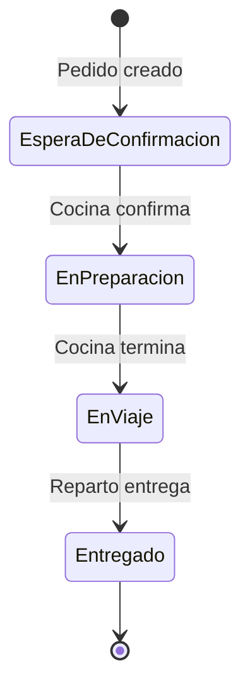

# Diagrama Entidad-Relación — BearPizzeria

## Entidades y Atributos

### Cliente
| Atributo | Tipo | Descripción |
|----------|------|-------------|
| `Id` | INT (PK) | Identificador único |
| `Nombre` | VARCHAR(100) | Nombre completo |
| `Direccion` | VARCHAR(200) | Dirección de entrega |
| `Telefono` | VARCHAR(20) | Teléfono de contacto |
| `Email` | VARCHAR(100) | Correo electrónico |

### Pizza
| Atributo | Tipo | Descripción |
|----------|------|-------------|
| `Id` | INT (PK) | Identificador único |
| `Nombre` | VARCHAR(100) | Nombre de la pizza |
| `Descripcion` | TEXT | Descripción e ingredientes |
| `Precio` | DECIMAL(10,2) | Precio unitario |
| `Tamano` | ENUM | Personal, Mediana, Grande, Familiar |

### Pedido
| Atributo | Tipo | Descripción |
|----------|------|-------------|
| `Id` | INT (PK) | Número de pedido |
| `ClienteId` | INT (FK) | Referencia al cliente |
| `FechaPedido` | DATETIME | Momento de creación |
| `Estado` | ENUM | Estado actual del ciclo de vida |
| `Total` | DECIMAL(10,2) | Monto total del pedido |

### PedidoPizza
| Atributo | Tipo | Descripción |
|----------|------|-------------|
| `PedidoId` | INT (PK, FK) | Referencia al pedido |
| `PizzaId` | INT (PK, FK) | Referencia a la pizza |
| `Cantidad` | INT | Cantidad solicitada |
| `PrecioUnitario` | DECIMAL(10,2) | Precio al momento del pedido |

## Diagrama Entidad-Relación (Mermaid)

```mermaid
erDiagram
    Cliente {
        int Id PK
        varchar Nombre
        varchar Direccion
        varchar Telefono
        varchar Email
    }

    Pedido {
        int Id PK
        int ClienteId FK
        datetime FechaPedido
        enum Estado
        decimal Total
    }

    Pizza {
        int Id PK
        varchar Nombre
        text Descripcion
        decimal Precio
        enum Tamano
    }

    PedidoPizza {
        int PedidoId PK FK
        int PizzaId PK FK
        int Cantidad
        decimal PrecioUnitario
    }

    Cliente ||--o{ Pedido : "realiza"
    Pedido ||--|{ PedidoPizza : "contiene"
    Pizza ||--o{ PedidoPizza : "incluida en"
```

## Relaciones

| Relación | Tipo | Descripción |
|----------|------|-------------|
| Cliente → Pedido | 1:N | Un cliente puede realizar varios pedidos. |
| Pedido → PedidoPizza | 1:N | Un pedido contiene múltiples ítems. |
| Pizza → PedidoPizza | 1:N | Una pizza puede aparecer en múltiples pedidos. |

## Ciclo de Vida del Pedido (Estados)


