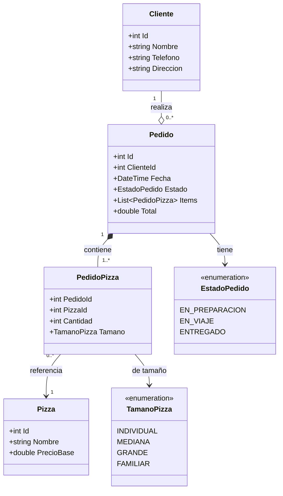
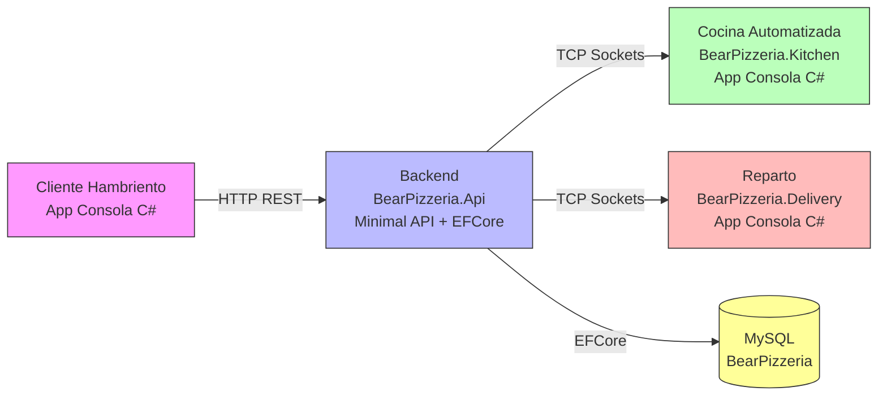
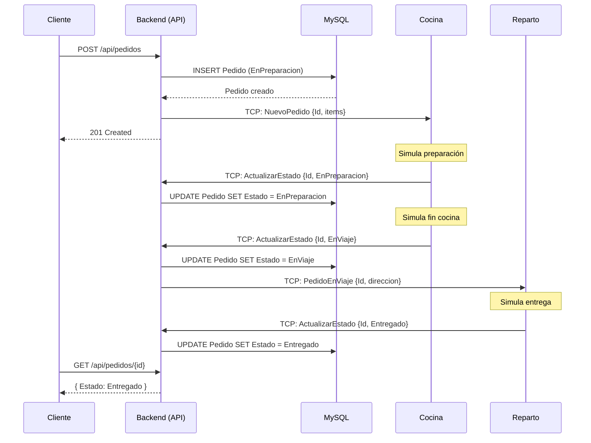

# Diagrama de Clases — BearPizzeria

## Diagrama UML

```mermaid
classDiagram
    %% --- Clientes ---
    class Cliente {
        +int Id
        +string Nombre
        +string Telefono
        +string Direccion
    }

    %% --- Pedidos ---
    class Pedido {
        +int Id
        +int ClienteId
        +DateTime Fecha
        +EstadoPedido Estado
        +List~PedidoPizza~ Items
        +double Total
    }

    class PedidoPizza {
        +int PedidoId
        +int PizzaId
        +int Cantidad
        +TamanoPizza Tamano
    }

    class Pizza {
        +int Id
        +string Nombre
        +double PrecioBase
    }

    class EstadoPedido {
        <<enumeration>>
        EN_PREPARACION
        EN_VIAJE
        ENTREGADO
    }

    class TamanoPizza {
        <<enumeration>>
        INDIVIDUAL
        MEDIANA
        GRANDE
        FAMILIAR
    }

    

    %% --- Relaciones ---
    Cliente "1" --o "0..*" Pedido : realiza
    Pedido "1" *-- "1..*" PedidoPizza : contiene
    PedidoPizza "0..*" --> "1" Pizza : referencia
    Pedido --> EstadoPedido : tiene
    PedidoPizza --> TamanoPizza : de tamaño

```

## Diagrama de Arquitectura Distribuida

```mermaid
flowchart LR
    CH[Cliente Hambriento<br/>App Consola C#]
    BK[Backend<br/>BearPizzeria.Api<br/>Minimal API + EFCore]
    CO[Cocina Automatizada<br/>BearPizzeria.Kitchen<br/>App Consola C#]
    RE[Reparto<br/>BearPizzeria.Delivery<br/>App Consola C#]
    DB[(MySQL<br/>BearPizzeria)]

    CH -- HTTP REST --> BK
    BK -- TCP Sockets --> CO
    BK -- TCP Sockets --> RE
    BK -- EFCore --> DB

    style CH fill:#f9f,stroke:#333
    style BK fill:#bbf,stroke:#333
    style CO fill:#bfb,stroke:#333
    style RE fill:#fbb,stroke:#333
    style DB fill:#ff9,stroke:#333
```

## Diagrama de Secuencia — Flujo Completo de un Pedido

```mermaid
sequenceDiagram
    participant C as Cliente
    participant API as Backend (API)
    participant DB as MySQL
    participant K as Cocina
    participant D as Reparto

    C->>API: POST /api/pedidos
    API->>DB: INSERT Pedido (EnPreparacion)
    DB-->>API: Pedido creado
    API->>K: TCP: NuevoPedido {Id, items}
    API-->>C: 201 Created
    Note over K: Simula preparación
    K->>API: TCP: ActualizarEstado {Id, EnPreparacion}
    API->>DB: UPDATE Pedido SET Estado = EnPreparacion
    Note over K: Simula fin cocina
    K->>API: TCP: ActualizarEstado {Id, EnViaje}
    API->>DB: UPDATE Pedido SET Estado = EnViaje
    API->>D: TCP: PedidoEnViaje {Id, direccion}
    Note over D: Simula entrega
    D->>API: TCP: ActualizarEstado {Id, Entregado}
    API->>DB: UPDATE Pedido SET Estado = Entregado
    C->>API: GET /api/pedidos/{id}
    API-->>C: { Estado: Entregado }
```
