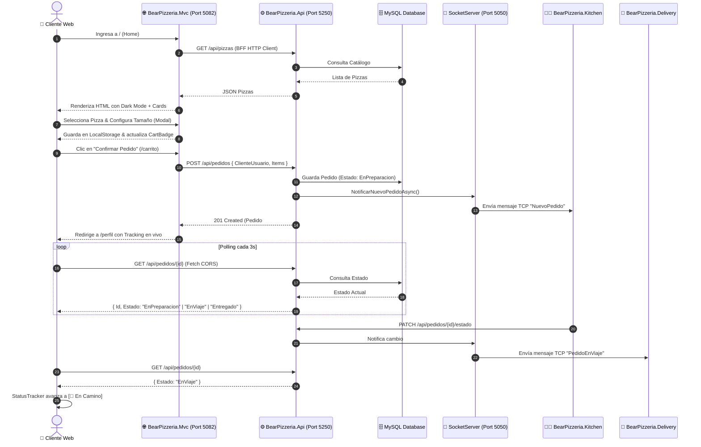

### B. Diagrama de Flujo de Datos y Conectividad

```mermaid
sequenceDiagram
    autonumber
    actor Usuario as 👤 Cliente Web
    participant MVC as 🌐 BearPizzeria.Mvc (Port 5082)
    participant API as ⚙️ BearPizzeria.Api (Port 5250)
    participant DB as 🗄️ MySQL Database
    participant Sockets as 🔌 SocketServer (Port 5050)
    participant Cocina as 👨‍🍳 BearPizzeria.Kitchen
    participant Delivery as 🛵 BearPizzeria.Delivery

    %% Carga inicial
    Usuario->>MVC: Ingresa a / (Home)
    MVC->>API: GET /api/pizzas (BFF HTTP Client)
    API->>DB: Consulta Catálogo
    DB-->>API: Lista de Pizzas
    API-->>MVC: JSON Pizzas
    MVC-->>Usuario: Renderiza HTML con Dark Mode + Cards

    %% Personalización y Carrito
    Usuario->>MVC: Selecciona Pizza & Configura Tamaño (Modal)
    MVC-->>Usuario: Guarda en LocalStorage & actualiza CartBadge

    %% Checkout / Crear Pedido
    Usuario->>MVC: Clic en "Confirmar Pedido" (/carrito)
    MVC->>API: POST /api/pedidos { ClienteUsuario, Items }
    API->>DB: Guarda Pedido (Estado: EnPreparacion)
    API->>Sockets: NotificarNuevoPedidoAsync()
    Sockets->>Cocina: Envía mensaje TCP "NuevoPedido"
    API-->>MVC: 201 Created (Pedido #{Id})
    MVC-->>Usuario: Redirige a /perfil con Tracking en vivo

    %% Tracking y Actualización
    loop Polling cada 3s
        Usuario->>API: GET /api/pedidos/{id} (Fetch CORS)
        API->>DB: Consulta Estado
        DB-->>API: Estado Actual
        API-->>Usuario: { Id, Estado: "EnPreparacion" | "EnViaje" | "Entregado" }
    end

    %% Avance en Cocina
    Cocina->>API: PATCH /api/pedidos/{id}/estado
    API->>Sockets: Notifica cambio
    Sockets->>Delivery: Envía mensaje TCP "PedidoEnViaje"
    
    %% Reflejo en UI
    Usuario->>API: GET /api/pedidos/{id}
    API-->>Usuario: { Estado: "EnViaje" }
    Usuario->>Usuario: StatusTracker avanza a [🛵 En Camino]
```