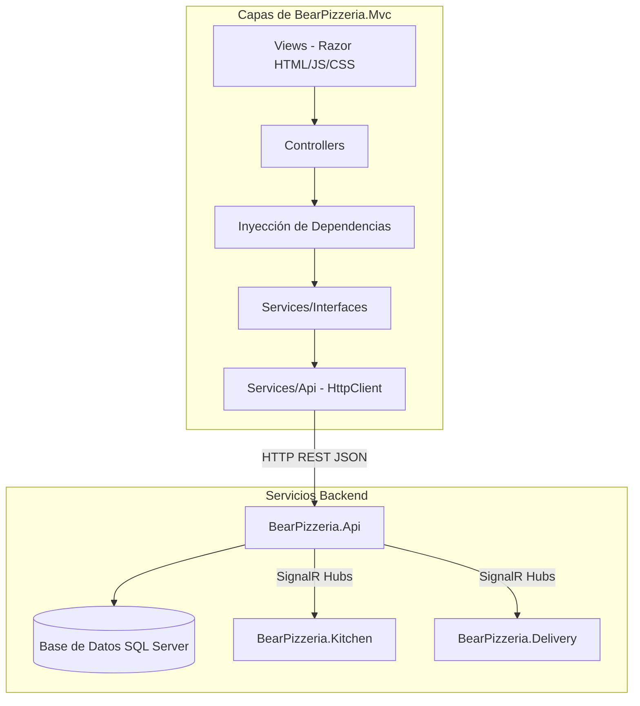

# Estructura del Patrón MVC en BearPizzeria

Este documento describe de manera detallada la arquitectura, componentes, flujos internos y desacoplamiento del módulo **`BearPizzeria.Mvc`**. Su objetivo es brindar una guía clara para comprender el procesamiento por detrás de cada módulo y diagnosticar fallos rápidamente en desarrollo y producción.

---

## 1. Arquitectura General y Posición del MVC

El sistema **BearPizzeria** sigue una arquitectura de microservicios / servicios desacoplados en .NET 9. Dentro de esta arquitectura, **`BearPizzeria.Mvc`** actúa como la interfaz de usuario web (Frontend Web) que consume la API REST principal (**`BearPizzeria.Api`**).



---

## 2. Estructura Interna del Proyecto `BearPizzeria.Mvc`

El proyecto se organiza bajo los estándares del patrón MVC (Modelo-Vista-Controlador) junto con una capa de servicios de API fuertemente tipados e interfaces desacopladas por modelo de dominio.

```
src/BearPizzeria.Mvc/
├── Controllers/
│   ├── AuthController.cs
│   ├── CartController.cs
│   ├── HomeController.cs
│   └── ProfileController.cs
├── Models/
│   ├── DTOs/                      # DTOs de transferencia recibidos/enviados a la API
│   │   ├── AuthDtos.cs
│   │   ├── CarritoDtos.cs
│   │   ├── PedidoDtos.cs
│   │   └── PizzaDtos.cs
│   └── ViewModels/                # Modelos específicos para binding en las Vistas Razor
│       ├── CartViewModel.cs
│       ├── HomeViewModel.cs
│       ├── LoginViewModel.cs
│       ├── ProfileViewModel.cs
│       └── RegisterViewModel.cs
├── Services/
│   ├── Interfaces/                # Interfaces por modelo de dominio
│   │   ├── ICarritoApiService.cs
│   │   ├── IPedidoApiService.cs
│   │   ├── IPizzaApiService.cs
│   │   └── IUsuarioApiService.cs
│   └── Api/                       # Implementaciones HttpClient desacopladas
│       ├── CarritoApiService.cs
│       ├── PedidoApiService.cs
│       ├── PizzaApiService.cs
│       └── UsuarioApiService.cs
├── Views/
│   ├── Auth/
│   ├── Cart/
│   ├── Home/
│   ├── Profile/
│   └── Shared/
├── Program.cs                     # Registro de DI, HttpClient y Cookie Authentication
└── appsettings.json               # Configuración de URLs de API y entornos
```

---

## 3. Desacoplamiento de Servicios de API (`Services/Interfaces` & `Services/Api`)

Cada consulta o mutación enviada a la API backend está desacoplada por su modelo correspondiente:

### 3.1 `IPizzaApiService` / `PizzaApiService`
- **Ubicación Interfaz**: `Services/Interfaces/IPizzaApiService.cs`
- **Ubicación Implementación**: `Services/Api/PizzaApiService.cs`
- **Responsabilidad**: Consultar el catálogo de pizzas disponibles.
- **Endpoints consumidos**:
  - `GET /api/pizzas`
  - `GET /api/pizzas/{id}`

### 3.2 `IUsuarioApiService` / `UsuarioApiService`
- **Ubicación Interfaz**: `Services/Interfaces/IUsuarioApiService.cs`
- **Ubicación Implementación**: `Services/Api/UsuarioApiService.cs`
- **Responsabilidad**: Autenticación, registro de nuevos clientes y obtención de la sesión.
- **Endpoints consumidos**:
  - `POST /api/auth/login`
  - `POST /api/auth/register`
  - `GET /api/auth/me/{clienteId}`

### 3.3 `ICarritoApiService` / `CarritoApiService`
- **Ubicación Interfaz**: `Services/Interfaces/ICarritoApiService.cs`
- **Ubicación Implementación**: `Services/Api/CarritoApiService.cs`
- **Responsabilidad**: Administrar la persisencia del carrito de compras en base de datos.
- **Endpoints consumidos**:
  - `GET /api/carrito/{clienteId}`
  - `POST /api/carrito/{clienteId}/items`
  - `PUT /api/carrito/items/{itemId}`
  - `DELETE /api/carrito/items/{itemId}`
  - `DELETE /api/carrito/{clienteId}/vaciar`
  - `POST /api/carrito/{clienteId}/checkout`

### 3.4 `IPedidoApiService` / `PedidoApiService`
- **Ubicación Interfaz**: `Services/Interfaces/IPedidoApiService.cs`
- **Ubicación Implementación**: `Services/Api/PedidoApiService.cs`
- **Responsabilidad**: Consultar pedidos activos e historial del cliente con autenticación Bearer Token.
- **Endpoints consumidos**:
  - `GET /api/pedidos/{id}`
  - `GET /api/pedidos/mi-pedido-activo`
  - `GET /api/pedidos/cliente/{clienteId}`

---

## 4. Registro en el Contenedor de Inyección de Dependencias (`Program.cs`)

En `Program.cs`, los clientes HTTP se registran como servicios tipados (*Typed Clients*) utilizando `AddHttpClient`:

```csharp
var apiBaseUrl = builder.Configuration["ApiSettings:BaseUrl"] ?? "http://localhost:5250";

builder.Services.AddHttpClient<IPizzaApiService, PizzaApiService>(client =>
{
    client.BaseAddress = new Uri(apiBaseUrl);
    client.Timeout = TimeSpan.FromSeconds(30);
});

builder.Services.AddHttpClient<IUsuarioApiService, UsuarioApiService>(client =>
{
    client.BaseAddress = new Uri(apiBaseUrl);
    client.Timeout = TimeSpan.FromSeconds(30);
});

builder.Services.AddHttpClient<ICarritoApiService, CarritoApiService>(client =>
{
    client.BaseAddress = new Uri(apiBaseUrl);
    client.Timeout = TimeSpan.FromSeconds(30);
});

builder.Services.AddHttpClient<IPedidoApiService, PedidoApiService>(client =>
{
    client.BaseAddress = new Uri(apiBaseUrl);
    client.Timeout = TimeSpan.FromSeconds(30);
});
```

---

## 5. Explicación del Proceso Paso a Paso por Módulo

### 5.1 Módulo de Autenticación (`AuthController`)
1. **Petición del usuario**: El usuario envía credenciales en `/Auth/Login`.
2. **Controlador**: `AuthController` invoca `_usuarioApiService.LoginAsync(...)`.
3. **Servicio API**: `UsuarioApiService` ejecuta `POST /api/auth/login`.
4. **Manejo de Sesión**: Al recibir `AuthResponseDto` exitoso, `AuthController` invoca `SignInUserAsync` creando una cookie cifrada con los claims:
   - `ClaimTypes.NameIdentifier`: `ClienteId`
   - `ClaimTypes.Name`: `Username`
   - `ClaimTypes.Email`: `Email`
   - `"Token"`: JWT Bearer Token.

### 5.2 Módulo Home y Catálogo (`HomeController`)
1. **Controlador**: `HomeController` recibe la solicitud GET a `/`.
2. **Servicio API**: Llama a `_pizzaApiService.GetPizzasAsync()`.
3. **Model & View**: Se encapsula la lista en `HomeViewModel` (incluyendo datos de usuario si está autenticado) y se pasa a la vista `Views/Home/Index.cshtml`.

### 5.3 Módulo de Carrito (`CartController`)
1. **Carga**: Al acceder a `/Cart`, se extrae el `ClienteId` de los Claims de la Cookie de autenticación.
2. **Servicio API**: Llama a `_carritoApiService.GetCarritoAsync(clienteId)`.
3. **Operaciones AJAX / Form**: La interacción cliente (agregar/quitar pizza) envía peticiones al API a través de `CarritoApiService`.
4. **Checkout**: `CartController.Checkout()` ejecuta `_carritoApiService.CheckoutCarritoAsync(clienteId)` que crea el registro de Pedido en backend y limpia el carrito.

### 5.4 Módulo de Perfil y Seguimiento (`ProfileController`)
1. **Petición**: El usuario entra a `/Profile` (protegido por `[Authorize]`).
2. **Extracción de Token**: Se obtiene el claim `"Token"` y `ClienteId`.
3. **Servicio API**: Llama a `_pedidoApiService.GetPedidosByClienteAsync(clienteId, token)`.
4. **Identificación de Pedido Activo**: Se filtra en el ViewModel si existe un pedido en estado `"EnPreparacion"` o `"EnViaje"`.

---

## 6. Guía de Diagnóstico y Resolución de Problemas (Troubleshooting)

Cuando se presente un fallo en la aplicación MVC, utilice este checklist de diagnóstico:

### ⚠️ Problema 1: Excepción `InvalidOperationException: Unable to resolve service for type 'IBearApiClient'`
- **Causa**: Algún componente intenta inyectar el antiguo cliente monolítico que fue sustituido.
- **Diagnóstico**: Buscar la interfaz obsoleta en el proyecto usando Grep/Search.
- **Solución**: Reemplazar la inyección por la interfaz desacoplada correspondiente (`IPizzaApiService`, `IUsuarioApiService`, `ICarritoApiService` o `IPedidoApiService`).

### ⚠️ Problema 2: Error 500 / HttpRequestException (No se puede conectar a la API)
- **Causa**: La URL de la API backend configurada en `appsettings.json` o `Program.cs` no coincide con el puerto activo de `BearPizzeria.Api`.
- **Diagnóstico**: Verificar la consola donde corre `BearPizzeria.Api` (normalmente `http://localhost:5250` o `http://localhost:5082`).
- **Solución**: Corregir `ApiSettings:BaseUrl` en `appsettings.json`.

### ⚠️ Problema 3: Redirección infinita o estado desautenticado tras recargar
- **Causa**: Problema con las cookies de autenticación o claims corruptos.
- **Diagnóstico**: Inspeccionar en las herramientas del navegador (F12 -> Storage -> Cookies) si la cookie `BearPizzeria.Auth` existe.
- **Solución**: Limpiar cookies del navegador y volver a iniciar sesión. Verificar en `AuthController.cs` que `SignInAsync` reciba los Claims correctamente.

### ⚠️ Problema 4: Pedidos o Historial regresan vacíos en el Perfil
- **Causa**: El token JWT almacenado en los claims de la cookie caducó o el header `Authorization: Bearer <token>` no se incluyó.
- **Diagnóstico**: Revisar los logs de `PedidoApiService` en la consola.
- **Solución**: Iniciar sesión nuevamente para renovar el claim `"Token"`.
