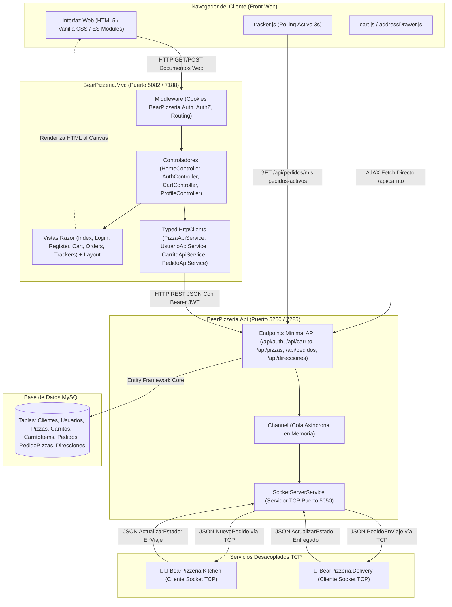
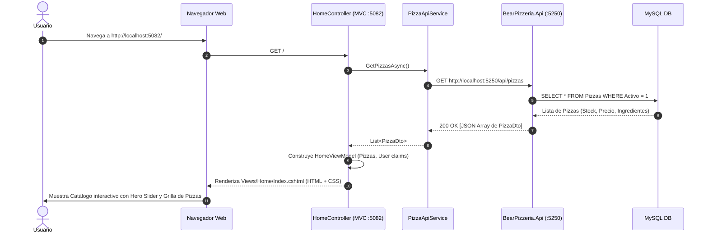
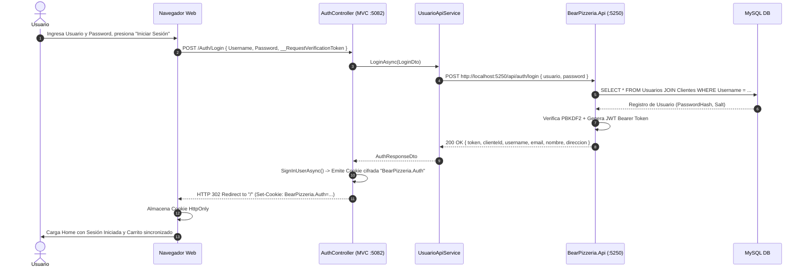
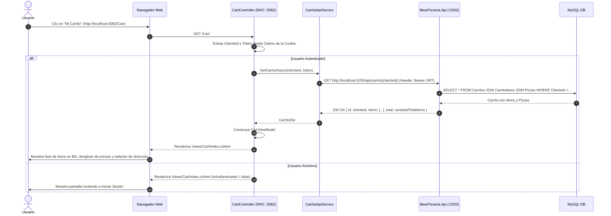
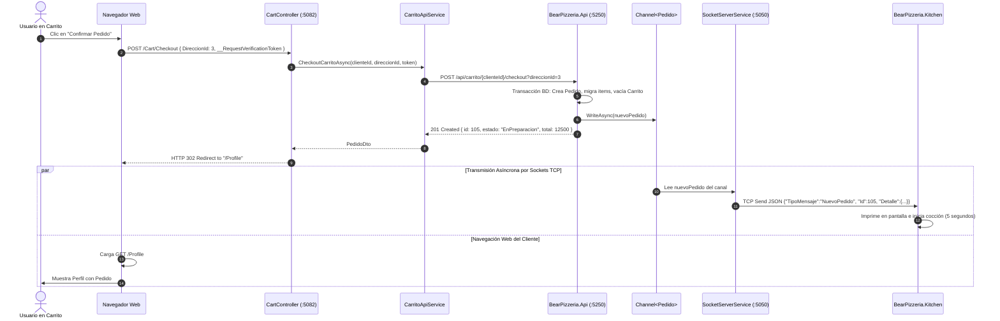
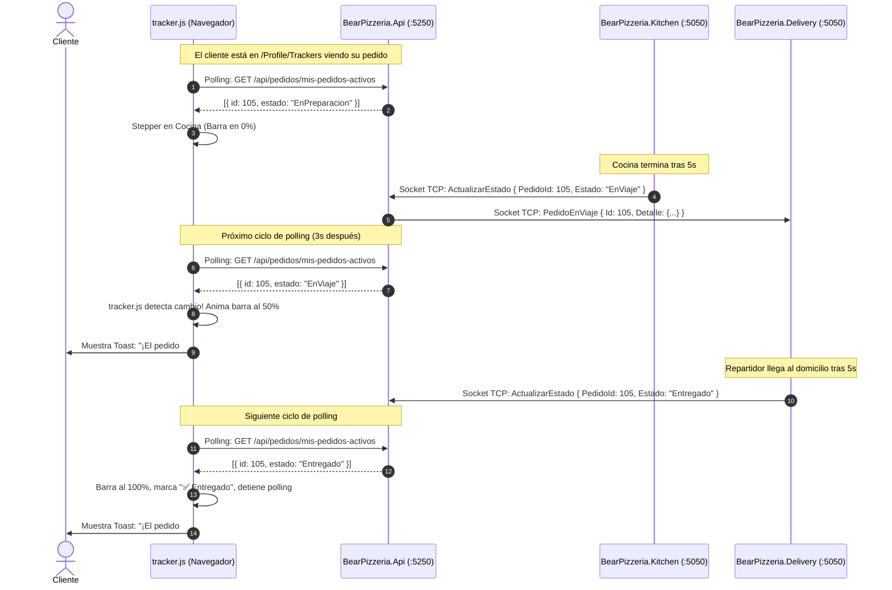
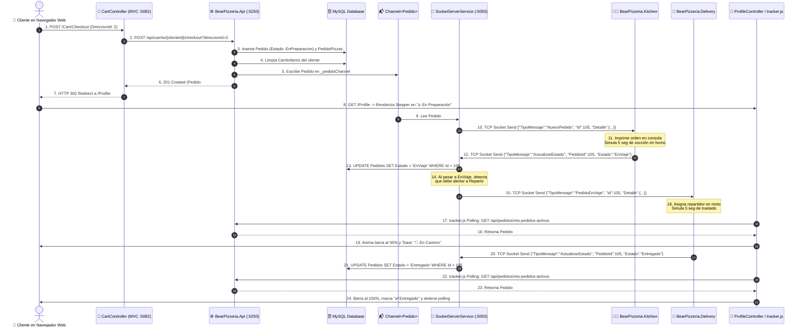

# Estructura del Patrón MVC en BearPizzeria

Este documento constituye la guía arquitectónica y operativa exhaustiva del proyecto **`BearPizzeria.Mvc`** y su integración en tiempo real con la **Minimal API (`BearPizzeria.Api`)**, la **base de datos relacional (MySQL)** y los servicios de **sockets TCP en segundo plano (`BearPizzeria.Kitchen` y `BearPizzeria.Delivery`)**.

Su propósito es responder detalladamente el ciclo completo de cada solicitud web:
> **"Si realizo una petición a una URL determinada (ej: `http://localhost:5082/Auth/Login`), ¿qué controlador la recibe?, ¿qué servicios y endpoints de la API consulta?, ¿qué vista Razor la construye?, ¿dónde y cómo se visualiza en el navegador?, y ¿cómo se propaga el estado mediante cookies y sockets?"**

---

## 1. Arquitectura General y Topología de Red

El ecosistema **BearPizzeria** opera con una topología de microservicios y clientes desacoplados en .NET 9:



### Tabla de Puertos y Responsabilidades

| Proyecto / Servicio | Protocolo / Puerto | Rol Arquitectónico | Dependencias Clave |
| :--- | :--- | :--- | :--- |
| **`BearPizzeria.Mvc`** | `http://localhost:5082`<br>`https://localhost:7188` | **Frontend Web (MVC)**: Genera vistas Razor enriquecidas, gestiona sesiones de usuario con Cookies HttpOnly cifradas y despacha acciones al backend. | Consume `BearPizzeria.Api` vía `HttpClient` tipado y llamadas AJAX desde módulos JS. |
| **`BearPizzeria.Api`** | `http://localhost:5250`<br>`https://localhost:7225` | **Backend Core (Minimal API)**: Lógica de negocio, persistencia en BD relacional, hashing PBKDF2, JWT y servidor de sockets. | MySQL Database (EF Core), `SocketServerService`. |
| **Sockets TCP Hub** | `TCP 0.0.0.0:5050` | **Canal de Sockets en tiempo real**: Administrado por `SocketServerService` en segundo plano en la API. | Notificaciones bidireccionales con cocina y reparto. |
| **`BearPizzeria.Kitchen`** | Conexión TCP saliente hacia `localhost:5050` | **Cocina Automatizada**: Recibe órdenes, simula cocción (5s) y cambia estado del pedido a `EnViaje`. | Cliente socket TCP puro. |
| **`BearPizzeria.Delivery`** | Conexión TCP saliente hacia `localhost:5050` | **Reparto Automatizado**: Recibe pedidos listos, simula viaje en moto (5s) y actualiza estado a `Entregado`. | Cliente socket TCP puro. |

---

## 2. Matriz Maestra de Enrutamiento y Despacho en `BearPizzeria.Mvc`

A continuación se resume cada dirección URL atendida por la aplicación web, indicando su controlador, las APIs involucradas, la vista que la renderiza y el sector de la pantalla donde se muestra:

| URL Solicitada | Método | Auth | Controlador y Acción | API Backend Invocada | Vista Razor (.cshtml) | Dónde se Muestra al Usuario |
| :--- | :--- | :--- | :--- | :--- | :--- | :--- |
| `http://localhost:5082/`<br>`http://localhost:5082/Home`<br>`http://localhost:5082/Home/Index` | `GET` | Libre | `HomeController.Index()` | `GET /api/pizzas` | `Views/Home/Index.cshtml`<br>+ `_HeroSlider`<br>+ `_CategoryBar`<br>+ `_ProductGrid` | Contenedor principal `<main>`: Carrusel superior, barra de filtros y grilla interactiva de pizzas con badges de stock. |
| `http://localhost:5082/Auth/Login` | `GET` | Libre | `AuthController.Login(returnUrl)` | Ninguna (Render estático) | `Views/Auth/Login.cshtml` | `<main>`: Tarjeta oscura centrada con formulario de usuario/contraseña y enlace a registro. |
| `http://localhost:5082/Auth/Login` | `POST` | Libre | `AuthController.Login(model)` | `POST /api/auth/login` | En éxito: Redirección<br>En error: `Views/Auth/Login.cshtml` | En éxito: Redirige a `/` o `returnUrl` emitiendo cookie.<br>En error: Muestra mensaje de credenciales inválidas en el formulario. |
| `http://localhost:5082/Auth/Register` | `GET` | Libre | `AuthController.Register()` | Ninguna (Render estático) | `Views/Auth/Register.cshtml` | `<main>`: Tarjeta centrada con formulario de alta de cliente (Nombre, Tel, Email, Usuario, Clave, Dirección). |
| `http://localhost:5082/Auth/Register` | `POST` | Libre | `AuthController.Register(model)` | `POST /api/auth/register` | En éxito: Redirección<br>En error: `Views/Auth/Register.cshtml` | En éxito: Auto-inicia sesión, emite cookie y redirige a `/` con alerta Toast.<br>En error: Muestra validación de campos duplicados. |
| `http://localhost:5082/Auth/Logout` | `POST`<br>`GET` | Auth | `AuthController.Logout()` | Ninguna (Local MVC) | Redirección a `Home/Index` | Elimina la cookie `BearPizzeria.Auth` del navegador y refresca la portada en modo anónimo. |
| `http://localhost:5082/Cart`<br>`http://localhost:5082/Cart/Index` | `GET` | Libre / Auth | `CartController.Index()` | `GET /api/carrito/{clienteId}` *(si auth)* | `Views/Cart/Index.cshtml` | `<main>`: Si es anónimo invita a iniciar sesión. Si está autenticado, lista items de la BD, selector de dirección y resumen de compra. |
| `http://localhost:5082/Cart/Checkout` | `POST` | Auth | `CartController.Checkout(direccionId)` | `POST /api/carrito/{clienteId}/checkout?direccionId={id}` | Redirección a `/Profile` o `/Cart` | Transfiere el carrito a un Pedido en la BD, dispara el socket a Cocina y redirige a `/Profile` con alerta verde. |
| `http://localhost:5082/Profile`<br>`http://localhost:5082/Profile/Index` | `GET` | Auth | `ProfileController.Index()` | `GET /api/pedidos/cliente/{id}`<br>`GET /api/pedidos/mis-pedidos-activos` | `Views/Profile/Index.cshtml` | `<main>`: Datos personales (con Live Preview), botón de direcciones, widget del último pedido activo y últimos 3 pedidos. |
| `http://localhost:5082/Profile/UpdateProfile` | `POST` | Auth | `ProfileController.UpdateProfile(model)` | `PUT /api/clientes/{id}` | Redirección a `/Profile` | Actualiza la BD en API, reemite los Claims de la Cookie y muestra alerta Toast de éxito en `/Profile`. |
| `http://localhost:5082/Profile/Trackers` | `GET` | Auth | `ProfileController.Trackers()` | `GET /api/pedidos/mis-pedidos-activos` | `Views/Profile/Trackers.cshtml` | `<main>`: Centro de control multipedido con steppers animados (Cocina -> Reparto -> Entregado) monitoreados cada 3s. |
| `http://localhost:5082/Profile/Orders` | `GET` | Auth | `ProfileController.Orders(page, fecha)` | `GET /api/pedidos/cliente/{id}` | `Views/Profile/Orders.cshtml` | `<main>`: Tabla paginada (10 por página) con filtro por fecha y botón "Repetir Pedido" con comprobación de stock. |
| `http://localhost:5082/Profile/ActiveOrdersJson` | `GET` | Auth | `ProfileController.ActiveOrdersJson()` | `GET /api/pedidos/mis-pedidos-activos` | JSON Data (Sin HTML) | Respuesta JSON pura para consumo de scripts del navegador. |
| `http://localhost:5082/Profile/ActiveOrderJson` | `GET` | Auth | `ProfileController.ActiveOrderJson()` | `GET /api/pedidos/mi-pedido-activo` | JSON Data (Sin HTML) | Respuesta JSON pura del pedido principal en curso. |
| `http://localhost:5082/Profile/AllOrdersJson` | `GET` | Auth | `ProfileController.AllOrdersJson()` | `GET /api/pedidos/cliente/{id}` | JSON Data (Sin HTML) | Respuesta JSON pura con el historial completo de pedidos. |

---

## 3. Desglose Exhaustivo de Cada URL y Flujos de Ejecución

---

### URL 1: `GET http://localhost:5082/` (o `/Home/Index`) — Catálogo Principal y Menú

#### Ficha Técnica
* **URL Invocada**: `http://localhost:5082/` o `http://localhost:5082/Home` o `http://localhost:5082/Home/Index`
* **Método HTTP**: `GET`
* **Controlador que lo consulta**: [HomeController](file:///mnt/Datos/Repos/PSR-MinimalAPI/src/BearPizzeria.Mvc/Controllers/HomeController.cs#L9-L49) -> Acción `Index()`
* **Servicios de API invocados**: `IPizzaApiService` ([PizzaApiService.cs](file:///mnt/Datos/Repos/PSR-MinimalAPI/src/BearPizzeria.Mvc/Services/Api/PizzaApiService.cs)) mediante `GetPizzasAsync()`.
* **Endpoint Backend consumido**: `GET http://localhost:5250/api/pizzas`
* **Vista que lo construye**: [Views/Home/Index.cshtml](file:///mnt/Datos/Repos/PSR-MinimalAPI/src/BearPizzeria.Mvc/Views/Home/Index.cshtml)
* **Vistas parciales ensambladas**:
  - `Views/Home/_HeroSlider.cshtml` (Promociones destacadas)
  - `Views/Home/_CategoryBar.cshtml` (Filtros de pizzas: Clásicas, Especiales, Gourmet)
  - `Views/Home/_ProductGrid.cshtml` (Grilla de tarjetas de productos)
  - `Views/Shared/_CustomizerModal.cshtml` (Modal emergente para selección de tamaño y porciones)
  - `Views/Shared/_AuthGuardModal.cshtml` (Modal preventivo si un anónimo intenta comprar)
* **Dónde y cómo se muestra al usuario**:
  - Se inyecta en el elemento `<main class="main-content container">` dentro de `_Layout.cshtml`.
  - Muestra la portada moderna en Dark Mode con el carrusel hero, badges reactivos de stock (`--stock-green`, `--stock-yellow`, `--stock-red`) y botones "Personalizar / Agregar".
* **Manejo de Sesión**:
  - Si el usuario está autenticado (detectado vía `User.Identity.IsAuthenticated`), el `HomeController` extrae los Claims de la cookie y popula `HomeViewModel.CurrentUser`.
  - En el encabezado (`_Header.cshtml`), el botón "Ingresar" se reemplaza automáticamente por el nombre del usuario y el icono de perfil.



---

### URL 2 y 3: `/Auth/Login` — Pantalla de Acceso y Procesamiento de Credenciales

#### Ficha Técnica: `GET http://localhost:5082/Auth/Login`
* **URL Invocada**: `http://localhost:5082/Auth/Login?returnUrl={urlOpcional}`
* **Método HTTP**: `GET`
* **Controlador que lo consulta**: [AuthController](file:///mnt/Datos/Repos/PSR-MinimalAPI/src/BearPizzeria.Mvc/Controllers/AuthController.cs#L22-L29) -> Acción `Login(string? returnUrl)`
* **Comportamiento**: Si el usuario ya posee una sesión activa (`User.Identity.IsAuthenticated == true`), lo redirige inmediatamente al Home (`/`). Si es anónimo, retorna `View(new LoginViewModel { ReturnUrl = returnUrl })`.
* **Vista que lo construye**: [Views/Auth/Login.cshtml](file:///mnt/Datos/Repos/PSR-MinimalAPI/src/BearPizzeria.Mvc/Views/Auth/Login.cshtml)
* **Dónde se muestra**: En `<main>`, como una tarjeta centrada con diseño Glassmorphism, inputs flotantes con iconos, validación visual y botón "Iniciar Sesión".

#### Ficha Técnica: `POST http://localhost:5082/Auth/Login`
* **URL Invocada**: `http://localhost:5082/Auth/Login`
* **Método HTTP**: `POST` (con cabecera CSRF `RequestVerificationToken`)
* **Controlador que lo procesa**: [AuthController](file:///mnt/Datos/Repos/PSR-MinimalAPI/src/BearPizzeria.Mvc/Controllers/AuthController.cs#L31-L51) -> Acción `Login(LoginViewModel model)`
* **Servicios de API invocados**: `IUsuarioApiService` ([UsuarioApiService.cs](file:///mnt/Datos/Repos/PSR-MinimalAPI/src/BearPizzeria.Mvc/Services/Api/UsuarioApiService.cs)) mediante `LoginAsync(new LoginDto(model.Username, model.Password))`.
* **Endpoint Backend consumido**: `POST http://localhost:5250/api/auth/login`
  - La API verifica las credenciales contrastando el hash PBKDF2 contra la tabla `Usuarios` y extrae los datos de `Clientes`.
  - Genera un token JWT firmado y retorna un `AuthResponseDto`.
* **Gestión de Cookies y Claims (Método `SignInUserAsync`)**:
  - Al recibir respuesta satisfactoria de la API, el controlador ejecuta:
    ```csharp
    var claims = new List<Claim> {
        new(ClaimTypes.NameIdentifier, auth.ClienteId.ToString()),
        new(ClaimTypes.Name, auth.Username),
        new(ClaimTypes.Email, auth.Email),
        new("Nombre", auth.Nombre),
        new("Direccion", auth.Direccion),
        new("Telefono", auth.Telefono),
        new("Token", auth.Token) // JWT para llamadas API posteriores
    };
    await HttpContext.SignInAsync(CookieAuthenticationDefaults.AuthenticationScheme, ...);
    ```
  - Se genera en el cliente la cookie cifrada **`BearPizzeria.Auth`** (`HttpOnly`, `SameSite=Lax`, expira en 7 días).
* **Dónde se muestra al usuario**:
  - **Éxito**: Redirige vía HTTP 302 a `returnUrl` (si es local) o a `/Home/Index`. La barra de navegación se actualiza mostrando el avatar del usuario y sincronizando el carrito persistido.
  - **Error (Credenciales incorrectas)**: Vuelve a renderizar `Views/Auth/Login.cshtml` con `ModelState.AddModelError` mostrando la alerta en rojo dentro de la tarjeta.



---

### URL 4 y 5: `/Auth/Register` — Formulario y Alta de Nuevo Cliente

#### Ficha Técnica: `GET http://localhost:5082/Auth/Register`
* **URL**: `http://localhost:5082/Auth/Register`
* **Método**: `GET`
* **Controlador**: [AuthController](file:///mnt/Datos/Repos/PSR-MinimalAPI/src/BearPizzeria.Mvc/Controllers/AuthController.cs#L53-L60) -> `Register()`
* **Vista que lo construye**: [Views/Auth/Register.cshtml](file:///mnt/Datos/Repos/PSR-MinimalAPI/src/BearPizzeria.Mvc/Views/Auth/Register.cshtml)
* **Dónde se muestra**: Formulario completo de registro con validaciones en tiempo real para Nombre, Teléfono, Correo, Usuario, Contraseña y Dirección.

#### Ficha Técnica: `POST http://localhost:5082/Auth/Register`
* **URL**: `http://localhost:5082/Auth/Register`
* **Método**: `POST`
* **Controlador**: [AuthController](file:///mnt/Datos/Repos/PSR-MinimalAPI/src/BearPizzeria.Mvc/Controllers/AuthController.cs#L62-L88) -> `Register(RegisterViewModel model)`
* **Servicio de API**: `IUsuarioApiService.RegisterAsync(...)` -> `POST http://localhost:5250/api/auth/register`
* **Efectos en la API y BD**:
  - Valida mediante FluentValidation que no existan duplicados de Email o Username.
  - Inserta el registro en la tabla `Clientes`.
  - Hashea la contraseña con PBKDF2 y crea la tupla en `Usuarios` vinculada por `ClienteId`.
  - Crea automáticamente una tupla vacía en la tabla `Carritos` para este cliente.
* **Respuesta en MVC**: Auto-inicia la sesión en el navegador con `SignInUserAsync()`, asigna `TempData["SuccessMessage"] = "¡Bienvenido ...! Tu cuenta ha sido creada."` y redirige al Home.

---

### URL 6: `/Auth/Logout` — Cierre de Sesión

* **URL**: `http://localhost:5082/Auth/Logout`
* **Método**: `POST` (o `GET` fallback)
* **Controlador**: [AuthController](file:///mnt/Datos/Repos/PSR-MinimalAPI/src/BearPizzeria.Mvc/Controllers/AuthController.cs#L90-L96) -> `Logout()`
* **Acción**: Ejecuta `HttpContext.SignOutAsync(CookieAuthenticationDefaults.AuthenticationScheme)`.
* **Dónde se refleja**: La cookie `BearPizzeria.Auth` se borra del navegador (`Max-Age=0`). Redirige al Home (`/`), limpiando los datos de usuario en pantalla y ocultando pedidos activos.

---

### URL 7: `GET http://localhost:5082/Cart` — Carrito de Compras Persistido en BD

#### Ficha Técnica
* **URL Invocada**: `http://localhost:5082/Cart` o `http://localhost:5082/Cart/Index`
* **Método HTTP**: `GET`
* **Controlador que lo consulta**: [CartController](file:///mnt/Datos/Repos/PSR-MinimalAPI/src/BearPizzeria.Mvc/Controllers/CartController.cs#L21-L49) -> Acción `Index()`
* **Servicio de API invocado**: `ICarritoApiService.GetCarritoAsync(clienteId, token)`
* **Endpoint Backend consumido**: `GET http://localhost:5250/api/carrito/{clienteId}`
* **Vista que lo construye**: [Views/Cart/Index.cshtml](file:///mnt/Datos/Repos/PSR-MinimalAPI/src/BearPizzeria.Mvc/Views/Cart/Index.cshtml)
* **Dónde y cómo se muestra al usuario**:
  - Si el usuario **no está autenticado**: Muestra una tarjeta con aviso claro: *"Iniciá sesión para ver tu carrito. Tus pizzas se guardan de forma segura directamente en nuestra base de datos para que nunca las pierdas"*.
  - Si el carrito **está vacío**: Muestra un estado ilustrado con botón para explorar pizzas.
  - Si **contiene pizzas**:
    - **Columna Izquierda (Items)**: Tarjetas de cada pizza agregada con imagen/emoji, nombre, tamaño seleccionado (Personal, Mediana, Grande, Familiar), precio unitario, botones interactivos (+) y (-) y botón para eliminar.
    - **Columna Derecha (Checkout)**: Resumen del pedido con subtotal, badge de *"Envío ¡GRATIS!"*, selector de dirección de entrega activa con botón para cambiar (abre el offcanvas `_AddressSidebar.cshtml`), total general destacado y botón principal **"Confirmar Pedido"**.



---

### URL 8: `POST http://localhost:5082/Cart/Checkout` — Confirmación de Pedido y Despacho a Sockets

#### Ficha Técnica
* **URL Invocada**: `http://localhost:5082/Cart/Checkout`
* **Método HTTP**: `POST` (con atributo `[Authorize]` y `[ValidateAntiForgeryToken]`)
* **Controlador que lo procesa**: [CartController](file:///mnt/Datos/Repos/PSR-MinimalAPI/src/BearPizzeria.Mvc/Controllers/CartController.cs#L51-L79) -> Acción `Checkout([FromForm] int? direccionId)`
* **Servicio de API invocado**: `ICarritoApiService.CheckoutCarritoAsync(clienteId, direccionId, token)`
* **Endpoint Backend consumido**: `POST http://localhost:5250/api/carrito/{clienteId}/checkout?direccionId={id}`
* **Lógica Interna en Backend (Api)**:
  1. Verifica que el carrito del cliente contenga al menos un item y que exista stock suficiente.
  2. Determina la dirección de entrega (la especificada en `direccionId` o la principal del cliente).
  3. Crea un registro en la tabla `Pedidos` con estado inicial `EnPreparacion` (`EstadoPedido = 1`).
  4. Transfiere cada item de `CarritoItems` a la tabla `PedidoPizzas` asociando precio y multiplicador de tamaño.
  5. Elimina todos los items de la tabla `CarritoItems` (vacía el carrito).
  6. Escribe el pedido en la cola de memoria `_pedidoChannel.Writer.WriteAsync(pedido)`.
  7. El servicio en segundo plano `SocketServerService` toma el pedido y lo transmite en formato JSON a través del puerto 5050 hacia la consola de **Cocina (`BearPizzeria.Kitchen`)**.
* **Dónde y cómo se muestra al usuario**:
  - El `CartController` recibe el `PedidoDto` confirmado.
  - Guarda un mensaje en TempData: `TempData["SuccessMessage"] = $"¡Pedido #{pedido.Id} confirmado con éxito!"`.
  - Redirige al usuario vía HTTP 302 a `http://localhost:5082/Profile`.
  - En la vista del perfil, se despliega inmediatamente la alerta verde y se activa el **Widget de Seguimiento en Vivo** con la barra en estado *"🔥 En Preparación"*.



---

### URL 9 y 10: `/Profile` — Perfil de Usuario, Direcciones y Actualización

#### Ficha Técnica: `GET http://localhost:5082/Profile`
* **URL**: `http://localhost:5082/Profile` o `http://localhost:5082/Profile/Index`
* **Método**: `GET` (requiere `[Authorize]`)
* **Controlador**: [ProfileController](file:///mnt/Datos/Repos/PSR-MinimalAPI/src/BearPizzeria.Mvc/Controllers/ProfileController.cs#L29-L65) -> `Index()`
* **Servicios de API invocados en paralelo**:
  - `_pedidoApiService.GetPedidosByClienteAsync(clienteId, token)`
  - `_pedidoApiService.GetMisPedidosActivosAsync(token)`
* **Vista que lo construye**: [Views/Profile/Index.cshtml](file:///mnt/Datos/Repos/PSR-MinimalAPI/src/BearPizzeria.Mvc/Views/Profile/Index.cshtml)
* **Dónde y cómo se muestra al usuario**:
  1. **Tarjeta de Cabecera**: Avatar con inicial del nombre, usuario, correo, teléfono y dirección, acompañado por los botones *"Mis Direcciones"*, *"Editar Perfil"* y *"Cerrar Sesión"*.
  2. **Formulario Colapsable (#editProfileCollapse)**: Edición de datos personales con script de **Live Preview** (los cambios en los inputs se previsualizan instantáneamente en la tarjeta superior).
  3. **Mis Direcciones de Entrega (#profile-address-list)**: Grid interactivo cargado vía AJAX que permite alternar la dirección predeterminada o abrir el drawer lateral.
  4. **Widget de Seguimiento en Vivo (#live-status-tracker)**: Si el cliente posee un pedido activo (`EnPreparacion` o `EnViaje`), renderiza una tarjeta con barra de progreso reactiva y estados:
     - `1. Cocina (🔥)`
     - `2. Reparto (🛵)`
     - `3. Entregado (✅)`
  5. **Historial de Pedidos Recientes**: Tabla con los últimos 3 pedidos con desglose de pizzas y botón *"Repetir Pedido"*.

#### Ficha Técnica: `POST http://localhost:5082/Profile/UpdateProfile`
* **URL**: `http://localhost:5082/Profile/UpdateProfile`
* **Método**: `POST` (con `[Authorize]` y `[ValidateAntiForgeryToken]`)
* **Controlador**: [ProfileController](file:///mnt/Datos/Repos/PSR-MinimalAPI/src/BearPizzeria.Mvc/Controllers/ProfileController.cs#L190-L220) -> `UpdateProfile(EditProfileViewModel model)`
* **Servicio de API**: `_usuarioApiService.UpdateClienteAsync(clienteId, request, token)` -> `PUT http://localhost:5250/api/clientes/{id}`
* **Refresco de Claims (`RefreshUserClaimsAsync`)**:
  - Al recibir los datos actualizados desde la API, el controlador regenera la identidad del usuario (`ClaimsPrincipal`) y reemite la cookie de autenticación sin necesidad de que el usuario vuelva a iniciar sesión.
* **Dónde se muestra**: Redirige a `/Profile` con `TempData["SuccessMessage"] = "¡Perfil y usuario actualizados con éxito!"`.

---

### URL 11: `GET http://localhost:5082/Profile/Trackers` — Centro de Seguimiento Multipedido

#### Ficha Técnica
* **URL Invocada**: `http://localhost:5082/Profile/Trackers`
* **Método HTTP**: `GET` (con `[Authorize]`)
* **Controlador que lo consulta**: [ProfileController](file:///mnt/Datos/Repos/PSR-MinimalAPI/src/BearPizzeria.Mvc/Controllers/ProfileController.cs#L67-L94) -> Acción `Trackers()`
* **Servicio de API invocado**: `_pedidoApiService.GetMisPedidosActivosAsync(token)` -> `GET http://localhost:5250/api/pedidos/mis-pedidos-activos`
* **Vista que lo construye**: [Views/Profile/Trackers.cshtml](file:///mnt/Datos/Repos/PSR-MinimalAPI/src/BearPizzeria.Mvc/Views/Profile/Trackers.cshtml)
* **Dónde y cómo se muestra al usuario**:
  - Diseñada especialmente para clientes que realizan múltiples pedidos simultáneos o desean una vista limpia dedicada exclusivamente al monitoreo.
  - Presenta un botón para volver al perfil (`/Profile`) y un contenedor `#active-trackers-container`.
  - Si no hay pedidos activos, muestra una pantalla vacía con ilustración y acceso al catálogo.
  - Si hay pedidos en curso, cada pedido se renderiza con un atributo `data-tracker-order` y su `data-order-id`.
  - El script del cliente `tracker.js` toma el control: realiza **polling cada 3000 ms** hacia `GET /api/pedidos/mis-pedidos-activos`, detecta transiciones de estado y actualiza el ancho de la barra (0% -> 50% -> 100%) y las clases `.active` y `.completed` con transiciones CSS fluidas y notificaciones Toast flotantes.



---

### URL 12: `GET http://localhost:5082/Profile/Orders` — Historial Completo Paginado

#### Ficha Técnica
* **URL Invocada**: `http://localhost:5082/Profile/Orders?page=1&fecha=2026-10-01`
* **Método HTTP**: `GET` (con `[Authorize]`)
* **Controlador que lo consulta**: [ProfileController](file:///mnt/Datos/Repos/PSR-MinimalAPI/src/BearPizzeria.Mvc/Controllers/ProfileController.cs#L96-L155) -> Acción `Orders(int page = 1, string? fecha = null)`
* **Servicio de API invocado**: `_pedidoApiService.GetPedidosByClienteAsync(clienteId, token)`
* **Vista que lo construye**: [Views/Profile/Orders.cshtml](file:///mnt/Datos/Repos/PSR-MinimalAPI/src/BearPizzeria.Mvc/Views/Profile/Orders.cshtml)
* **Dónde y cómo se muestra al usuario**:
  - Filtro por fecha interactivo mediante `<input type="date">` con botón de reseteo.
  - Si no hay filtro, omite los 3 pedidos más recientes (que ya se exponen en el perfil general) y pagina el resto en bloques de **10 pedidos por página**.
  - Tarjetas detalladas de cada pedido anterior con:
    - ID de pedido y fecha formateada (`dd/MM/yyyy HH:mm hs`).
    - Badge de estado final (`Entregado`, `Cancelado`).
    - Lista de pizzas adquiridas con porciones, precio unitario y total abonado.
    - Botón **"Repetir Pedido"**: ejecuta una verificación asíncrona de stock de cada pizza. Si hay stock, las añade al carrito actual y abre el modal confirmatorio `_RepeatOrderStockModal.cshtml`.
  - Paginador numérico inferior con botones *Anterior*, números de página y *Siguiente*.

---

### URLs 13, 14 y 15: Endpoints JSON Auxiliares de Perfil

1. **`GET http://localhost:5082/Profile/ActiveOrdersJson`**:
   - Acción: `ProfileController.ActiveOrdersJson()`
   - Propósito: Proveer una vía interna en el dominio MVC para consultar en formato JSON la colección completa de pedidos activos. Responde con `[ResponseCache(NoStore = true)]`.
2. **`GET http://localhost:5082/Profile/ActiveOrderJson`**:
   - Acción: `ProfileController.ActiveOrderJson()`
   - Propósito: Retornar únicamente el pedido activo más prioritario.
3. **`GET http://localhost:5082/Profile/AllOrdersJson`**:
   - Acción: `ProfileController.AllOrdersJson()`
   - Propósito: Endpoint JSON con la totalidad del histórico del cliente autenticado.

---

## 4. Módulos JavaScript del Frontend y Consumo Híbrido de la API

La aplicación MVC incorpora una arquitectura híbrida de alto rendimiento: renderiza las vistas y layouts en el servidor mediante Razor, mientras que las interacciones rápidas de catálogo, personalización y tracking se orquestan en el navegador mediante módulos JavaScript ES6 ubicados en `wwwroot/js/modules/`:

```
wwwroot/js/
├── app.js                      # Orquestador principal (initApp al cargar DOM)
└── modules/
    ├── api.js                  # Cliente fetch centralizado hacia http://localhost:5250
    ├── auth.js                 # Lector de tokens y datos de usuario desde data-attributes
    ├── cart.js                 # Mutaciones del carrito en tiempo real (Add, Update, Remove, Clear)
    ├── customizer.js           # Modal de selección de tamaño de pizzas (0.70x a 1.30x)
    ├── tracker.js              # Polling de pedidos activos (3s) y animación del stepper
    ├── addressDrawer.js        # Offcanvas de administración de direcciones de entrega
    ├── addresses.js            # Servicios API para CRUD de direcciones
    ├── repeatOrderModal.js     # Validaciones de stock y clonación de pedidos históricos
    └── ui.js                   # Búsqueda con debounce, toasts y drawers mobile
```

### 1. `cart.js` — Mutaciones Directas sobre la Base de Datos
* Cuando el usuario pulsa (+) o (-) en el carrito o en las tarjetas de pizza, **no** se recarga la página.
* `CartManager` despacha peticiones AJAX vía `apiFetch`:
  - `POST /api/carrito/{clienteId}/items` (añadir pizza con tamaño seleccionado).
  - `PUT /api/carrito/items/{itemId}` (modificar cantidad).
  - `DELETE /api/carrito/items/{itemId}` (quitar pizza).
  - `DELETE /api/carrito/{clienteId}/vaciar` (vaciar carrito).
* Actualiza los contadores de badges en el header (`.cart-badge-count`) y dispara el evento `cart:updated` en el DOM.

### 2. `customizer.js` — Personalizador de Tamaños y Cálculo de Porciones
* Abre el modal `_CustomizerModal.cshtml` al hacer clic en *"Personalizar / Agregar"* en cualquier pizza.
* Aplica los factores de escala de precios oficiales definidos en el sistema:
  - **Personal**: Multiplicador `0.70` (4 porciones).
  - **Mediana**: Multiplicador `0.85` (6 porciones).
  - **Grande**: Multiplicador `1.00` (8 porciones - Precio Base).
  - **Familiar**: Multiplicador `1.30` (12 porciones).
* Actualiza el precio mostrado en tiempo real antes de enviar la orden al carrito en la BD.

### 3. `addressDrawer.js` — Gestión de Direcciones en Offcanvas
* Se abre al hacer clic en *"Mis Direcciones"* o *"Cambiar"* en el checkout.
* Interactúa con los endpoints REST `/api/clientes/{clienteId}/direcciones` permitiendo:
  - Listar direcciones con etiquetas (*"Casa"*, *"Trabajo"*, *"Depto"*).
  - Crear nuevas direcciones completando calle, número, piso y referencias.
  - Marcar una dirección como predeterminada mediante `PUT .../principal`.
  - Refrescar automáticamente la dirección activa en el checkout de la vista `/Cart`.

### 4. `tracker.js` — Sincronización en Tiempo Real con Cocina y Reparto
* Se activa al detectar tarjetas con el atributo `data-tracker-order`.
* Realiza consultas periódicas a intervalos de 3 segundos a `GET /api/pedidos/mis-pedidos-activos`.
* Transiciona fluidamente el ancho de `.tracker-progress-bar`:
  - `EnPreparacion` -> `width: 0%`, paso Cocina activo.
  - `EnViaje` -> `width: 50%`, paso Cocina completado, paso Reparto activo.
  - `Entregado` -> `width: 100%`, todos los pasos completados.
* Al llegar a `Entregado`, detiene el temporizador para liberar recursos del cliente y del servidor.

---

## 5. El Camino Completo de un Pedido: De la Vista Razor a los Sockets TCP

El siguiente diagrama detalla la travesía completa de una solicitud desde que el cliente hace clic en **"Confirmar Pedido"** hasta que el repartidor entrega la pizza en el domicilio:



---

## 6. Guía de Diagnóstico y Rastreo de Problemas (Troubleshooting)

Cuando se presente un comportamiento inesperado en las vistas o en la comunicación en tiempo real, utilice el siguiente mapa de diagnóstico:

### ⚠️ Caso 1: Al navegar a `/Profile` o `/Cart`, se redirige automáticamente a `/Auth/Login`
* **Causa**: La cookie de autenticación `BearPizzeria.Auth` no existe, expiró o sus claims no pudieron ser deserializados.
* **Comprobación**: Abrir las Herramientas de Desarrollador del Navegador (`F12`), dirigirse a la pestaña **Application / Storage -> Cookies -> `http://localhost:5082`** y validar la presencia de la cookie `BearPizzeria.Auth`.
* **Solución**: Iniciar sesión nuevamente en `/Auth/Login`. Verificar que la configuración de `AddAuthentication` en `Program.cs` coincida con el esquema de cookies.

### ⚠️ Caso 2: El Stepper de seguimiento se queda fijo en "🔥 En Preparación" y nunca avanza
* **Causa 1 (Consola de Cocina no iniciada)**: El proyecto `BearPizzeria.Kitchen` no está en ejecución o no se conectó al puerto `5050`.
* **Causa 2 (Consola de Reparto no iniciada)**: `BearPizzeria.Delivery` no está corriendo para recibir el pedido en viaje.
* **Comprobación**:
  - Verificar que la terminal de la API muestre: `SocketServer iniciado en puerto 5050`.
  - Verificar que la consola de cocina muestre: `Cocina registrada`.
  - Inspeccionar la consola de red del navegador: si las peticiones a `/api/pedidos/mis-pedidos-activos` devuelven `401 Unauthorized`, el token JWT en el data-attribute del `<body>` no es válido.
* **Solución**: Ejecutar en terminales separadas:
  ```bash
  dotnet run --project src/BearPizzeria.Kitchen
  dotnet run --project src/BearPizzeria.Delivery
  ```

### ⚠️ Caso 3: Error de conexión HTTP (500 o HttpRequestException) al consultar pizzas o carrito
* **Causa**: `BearPizzeria.Mvc` no puede alcanzar el puerto de `BearPizzeria.Api`.
* **Comprobación**: Verificar la URL configurada en `src/BearPizzeria.Mvc/appsettings.json`:
  ```json
  "ApiSettings": {
    "BaseUrl": "http://localhost:5250"
  }
  ```
* **Solución**: Asegurarse de que `BearPizzeria.Api` esté corriendo en el puerto `5250`. Si corre en otro puerto (por ejemplo `5000` o `5082`), corregir `BaseUrl` en el archivo de configuración.

### ⚠️ Caso 4: Las operaciones de carrito devuelven error de CORS en la consola del navegador
* **Causa**: La política de CORS en `BearPizzeria.Api` no incluye el origen exacto del frontend MVC.
* **Comprobación**: Revisar en `BearPizzeria.Api/Program.cs` la política `AllowMvcClient`:
  ```csharp
  builder.Services.AddCors(options => {
      options.AddPolicy("AllowMvcClient", policy => {
          policy.WithOrigins("http://localhost:5082", "https://localhost:7188")
                .AllowAnyHeader()
                .AllowAnyMethod();
      });
  });
  ```
* **Solución**: Corroborar que el puerto desde el cual se abre el navegador coincida exactamente con los orígenes permitidos.
